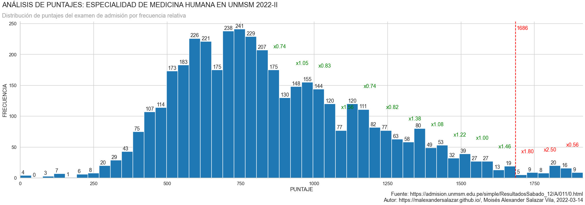
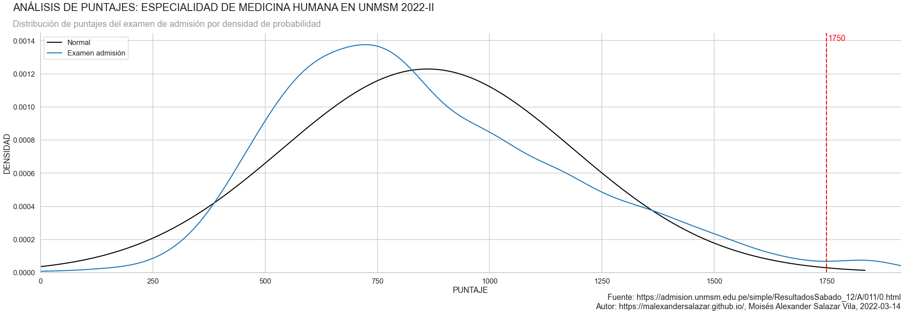
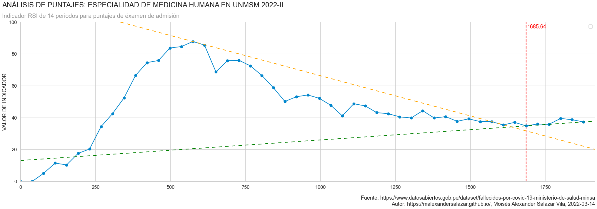

# Análisis de los resultados del examen de admisión para la especialidad de Medicina Humana en la UNMSM

## Antecedentes

La UNMSM realizó su primer examen de admisión 2022 este 12 de marzo y miles de jóvenes asistieron a las instalaciones para rendir la prueba y alcanzar una vacante de estudios superiores. Sin embargo, una serie de problemas surgieron tras la publicación de los resultados. En redes sociales se viralizaron unas imágenes en las que se leen algunas preguntas de la última prueba. Ante ello, el Centro de Estudiantes de Medicina de la Facultad de Medicina de San Fernando de dicha casa de estudios instó a sus autoridades a revisar con detenimiento las pruebas de los postulantes cuyos puntajes resultaron en empates. [[1]]

## Proceso

Este proyecto se desarrolló en Python 3.8.5 usando los paquetes **requests**, **BeautifulSoup**, **numpy**, **decimal**, **pandas**, **matplotlib**, **seaborn** y **scipy.stats**.

### Adquisición de Datos

Obtuve los resultados del examen de admisión de la UNMSM 2022-II en modalidad EDUCACIÓN BÁSICA REGULAR (EBR) Y EDUCACIÓN BÁSICA ALTERNATIVA (EBA) para la escuela profesional de MEDICINA HUMANA del sitio web de la Oficina Central de la Admisión. [[2]]

## Resultados

Si contenemos los puntajes en 50 rangos podemos apreciar que algunos de los puntajes a partir de 1686 crecen en una proporción irregular y mucho más alta que en los casos precedentes.

Se puede apreciar una divergencia entre la densidad de probabilidad de la distribución normal y la de los puntajes del examen de admisión a partir de los puntajes mayores a 1750. A pesar que la primera tiende a 0, la segunda tiene un incremento.

De acuerdo al índice de fuerza relativa, hay señales de un posible cambio de tendencia a partir de los puntajes superiores a 1685. Los retrocesos en al RSI a partir de ese punto forman una línea con tendencia al alza.

## Conclusiones

La Universidad Nacional Mayor de San Marcos rechazó que haya existido alguna irregularidad durante el proceso de admisión 2022 II [[3]]. Sin embargo, dados los resultados del presente análisis puedo concluir que **SÍ HAY IRREGULARIDADES EN LOS RESULTADOS**.

## Referencias

1. Sociedad LR. (13 de marzo de 2022). _UNMSM: estudiantes de Medicina Humana piden investigar a postulantes con puntajes sospechosos_. Grupo La República Publicaciones. Recuperado el 14 de marzo de 2022 de https://larepublica.pe/sociedad/2022/03/13/unmsm-estudiantes-de-medicina-humana-piden-se-investigue-a-postulantes-con-puntajes-sospechosos/

[1]: https://larepublica.pe/sociedad/2022/03/13/unmsm-estudiantes-de-medicina-humana-piden-se-investigue-a-postulantes-con-puntajes-sospechosos/

2. Oficina Central de Admisión. (13 de marzo de 2022). _Resultados Admisión 2022-11: EBR/EBA - Medicina Humana_. Universidad Mayor de San Marcos. Recuperado el 14 de marzo de 2022 de https://admision.unmsm.edu.pe/simple/ResultadosSabado_12/A/011/0.html

[2]: https://admision.unmsm.edu.pe/simple/ResultadosSabado_12/A/011/0.html

3. Universidad Mayor de San Marcos. (13 de marzo de 2022). _COMUNICADO | La #UNMSM desmiente las informaciones que vienen circulando en redes sociales sobre supuestos fraudes durante el Examen de Admisión 2022-II_. Facebook. Recuperado el 14 de marzo de 2022 de https://www.facebook.com/1551UNMSM/posts/7075665145838009

[3]: https://www.facebook.com/1551UNMSM/posts/7075665145838009